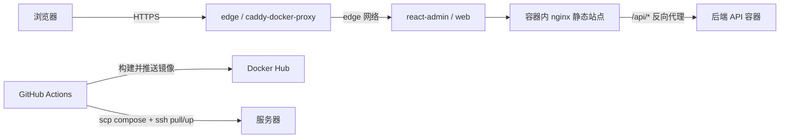

# 部署文档

本文说明如何将 `react-admin` 部署到一台 Linux 服务器，并通过 GitHub Actions 在推送 `main` 分支时自动发布。

## 架构概览

服务器上分为两层：

- **Edge 栈（`~/edge/`）**：全机共用，占用 `80` / `443`，负责按域名转发请求并自动申请、续签 HTTPS 证书。
- **业务栈（`DEPLOY_PATH`）**：只运行本项目容器，不直接绑定宿主机端口，通过 Docker 标签把域名交给 Edge 处理。



前端所有 API 请求都走同源的 `/api/*`，由容器内 nginx 反向代理到后端容器，前端 bundle 中不暴露后端地址。

触发方式：

- 推送到 `main` 分支
- 在 GitHub Actions 中手动执行 `workflow_dispatch`

## 前置条件

### 服务器

- 已安装 Docker 与 Docker Compose 插件
- 已创建部署用户（示例：`deploy`），并具备 `docker` 权限
- 安全组 / 防火墙放行 `80`、`443`
- 若 SSH 不是 `22` 端口，需在 `.github/workflows/deploy.yml` 的 `scp-action`、`ssh-action` 步骤中补充 `port` 配置

### 域名

- 为本项目准备独立域名，例如 `admin.example.com`
- 在域名服务商添加 **A 记录**，指向服务器公网 IP
- 生效后可用 `dig +short admin.example.com` 检查解析

### Docker Hub

- 已创建镜像仓库，名称与 workflow 中 `IMAGE_NAME` 一致（默认 `react-admin`）
- 已准备用户名与 Access Token

### GitHub 仓库

- 已启用 Actions
- 已配置下文列出的 Secrets

## 一次性初始化 Edge 栈

Edge 栈模板位于仓库 `deploy/edge/`，每台服务器只需部署一次。

### 1. 上传文件

在本机项目根目录执行：

```bash
scp -r deploy/edge deploy@your-server:~/edge
```

若使用私钥登录：

```bash
scp -i ~/.ssh/your_key -r deploy/edge deploy@your-server:~/edge
```

### 2. 配置证书通知邮箱

SSH 登录服务器，编辑 `~/edge/Caddyfile`，将 `admin@example.com` 改为你的真实邮箱。

### 3. 启动 Edge

```bash
ssh deploy@your-server
cd ~/edge
docker compose up -d
docker network ls | grep edge
docker compose ps
```

确认 `edge` 网络已创建，且 `caddy` 容器处于运行状态。

Edge 使用镜像 `lucaslorentz/caddy-docker-proxy:ci-alpine`。它会读取业务容器上的 `caddy.*` 标签，自动生成路由与 TLS 配置；新增业务项目时通常无需再改 `~/edge/`。

## 配置 GitHub Secrets

在仓库 **Settings → Secrets and variables → Actions** 中添加：

| Secret               | 是否必填 | 说明                                                    |
| -------------------- | -------- | ------------------------------------------------------- |
| `DOCKERHUB_USERNAME` | 是       | Docker Hub 用户名                                       |
| `DOCKERHUB_TOKEN`    | 是       | Docker Hub Access Token                                 |
| `SSH_HOST`           | 是       | 服务器公网 IP 或域名                                    |
| `SSH_USER`           | 是       | SSH 用户名，例如 `deploy`                               |
| `SSH_PRIVATE_KEY`    | 是       | 与服务器 `authorized_keys` 匹配的私钥全文               |
| `DEPLOY_PATH`        | 是       | 本项目在服务器上的目录，例如 `/home/deploy/react-admin` |
| `SSL_DOMAIN`         | 是       | 对外访问域名，只填主机名，例如 `admin.example.com`      |
| `BACKEND_UPSTREAM`   | 是       | 后端 API 上游地址，nginx 反向代理目标，例如 `http://backend:8000` |

`SSL_DOMAIN` 不要包含 `https://`、端口或路径。该值会写入服务器 `.env`，并映射到容器标签 `caddy: ${SSL_DOMAIN}`。

`BACKEND_UPSTREAM` 必须包含协议（`http://` 或 `https://`），不要带尾部斜杠。前端容器内 nginx 会把 `/api/<path>` 重写为 `<path>` 后转发到该地址（与开发环境 Vite proxy 行为保持一致）。

- 后端是另一个 Docker 容器并已加入 `edge` 网络：`http://<容器名>:<端口>`，例如 `http://backend:8000`
- 后端是同台机器上的另一个进程（监听宿主机端口）：`http://host.docker.internal:<端口>`，并在 `docker-compose.yml` 的 `web` 服务下加 `extra_hosts: ["host.docker.internal:host-gateway"]`
- 后端是外部服务：`https://api.example.com`

## 首次部署本项目

### 1. 准备服务器目录

```bash
ssh deploy@your-server
mkdir -p /home/deploy/react-admin
```

`DEPLOY_PATH` 必须与该目录一致。

### 2. 触发部署

推送代码到 `main`，或在 GitHub Actions 中手动运行 **Build, push Docker Hub, deploy ECS**。

Workflow 会依次执行：

1. 构建前端镜像并推送到 Docker Hub，标签为完整 commit SHA
2. 将 `docker-compose.yml` 复制到 `DEPLOY_PATH`
3. SSH 到服务器写入 `.env`，执行 `docker compose pull` 与 `docker compose up -d`

服务器 `.env` 示例：

```env
DOCKER_IMAGE=<dockerhub-username>/react-admin:<git-sha>
SSL_DOMAIN=admin.tangyinxuan.top
BACKEND_UPSTREAM=http://backend:8000
```

### 3. 验证

```bash
ssh deploy@your-server
cd /home/deploy/react-admin
docker compose ps
cd ~/edge
docker compose logs --tail 100 caddy
```

浏览器访问 `https://admin.tangyinxuan.top`。首次签发证书通常需要数秒到一分钟。

## 日常发布

合并到 `main` 后，GitHub Actions 会自动构建新镜像并滚动更新 `web` 容器。业务栈不负责证书续签，续签由 Edge 中的 Caddy 自动完成。

本地仅验证构建时，可执行：

```bash
docker build -t react-admin:local .
```

## API 反向代理

前端所有请求统一走同源 `/api/*`，由容器内 nginx 反向代理到 `BACKEND_UPSTREAM`：

```text
浏览器  https://admin.example.com/api/users
   ↓ HTTPS
Caddy（edge）-> web 容器 nginx
   ↓ /api/users 重写为 /users
后端容器 http://backend:8000/users
```

要点：

- nginx 模板位于 `nginx/default.conf.template`，容器启动时由官方镜像的 entrypoint 通过 envsubst 替换 `${BACKEND_UPSTREAM}` 生成实际配置。
- 使用 Docker 内置 DNS（`127.0.0.11`）解析容器名，后端容器重启换 IP 也能自动恢复，无需重启前端容器。
- 已设置 `Host`、`X-Real-IP`、`X-Forwarded-For`、`X-Forwarded-Proto` 等转发头，后端可正常拿到原始客户端信息与协议。
- 已开启 `Upgrade` 头转发，兼容 WebSocket / SSE。
- 已关闭 `proxy_buffering` 并将超时调至 300s，适合长连接与流式响应。

修改后端地址只需更新 GitHub Secret `BACKEND_UPSTREAM` 并重跑 workflow，无需重新构建镜像。

## 构建时环境变量

正常情况下前端不需要 `VITE_API_BASE_URL`，所有 API 走同源 `/api`。

若有特殊场景需要让构建产物直连某个绝对地址（例如本地开发连远端联调，绕开 nginx 代理），可在构建时注入：

- `Dockerfile` 中对应的 `ARG` / `ENV`
- `.github/workflows/deploy.yml` 的 `build-push-action` 步骤，补充 `build-args`

未注入时，前端使用代码中的默认值（`/api`，同源走 nginx 代理）。

## 接入更多项目

同一台服务器可部署多个项目，每个项目使用不同域名与不同 `DEPLOY_PATH`。业务 `docker-compose.yml` 参考本项目：

- 不绑定宿主机 `ports`
- 设置稳定 `container_name`
- 添加 `caddy`、`caddy.reverse_proxy`、`caddy.encode` 标签
- 加入外部网络 `edge`

部署完成后，Edge 会自动发现新容器并签发对应域名证书，一般无需修改 `~/edge/`。

## 常见问题

### `Permission denied (publickey)`

说明本机 SSH 私钥未被服务器 `authorized_keys` 接受。请确认使用的私钥与 GitHub Secret `SSH_PRIVATE_KEY` 一致，或把本机公钥追加到服务器。

### `caddy-docker-proxy:2-alpine: not found`

请使用 `ci-alpine` 标签，不要使用 `2-alpine`。

### 部署成功但网站无法访问

按顺序检查：

1. 域名 A 记录是否指向当前服务器
2. `80` / `443` 是否放行
3. `~/edge` 中 `caddy` 是否运行
4. 业务容器是否加入 `edge` 网络
5. `SSL_DOMAIN` 是否与访问域名完全一致
6. `docker compose logs caddy` 中是否有证书申请错误

### 业务容器正常，但 HTTPS 失败

多为 Let's Encrypt 无法访问服务器的 `80` 或 `443`。确认没有其他进程占用这两个端口，且 Edge 栈独占宿主机 `80` / `443`。

## 相关文件

| 路径                             | 作用                                    |
| -------------------------------- | --------------------------------------- |
| `.github/workflows/deploy.yml`   | 构建、推送、部署 workflow               |
| `docker-compose.yml`             | 服务器业务栈定义                        |
| `Dockerfile`                     | 前端构建与运行时镜像                    |
| `nginx/default.conf.template`    | 容器内 nginx 模板（含 `/api` 反向代理） |
| `deploy/edge/`                   | Edge 栈一次性部署模板                   |
| `deploy/edge/README.md`          | Edge 栈补充说明                         |
